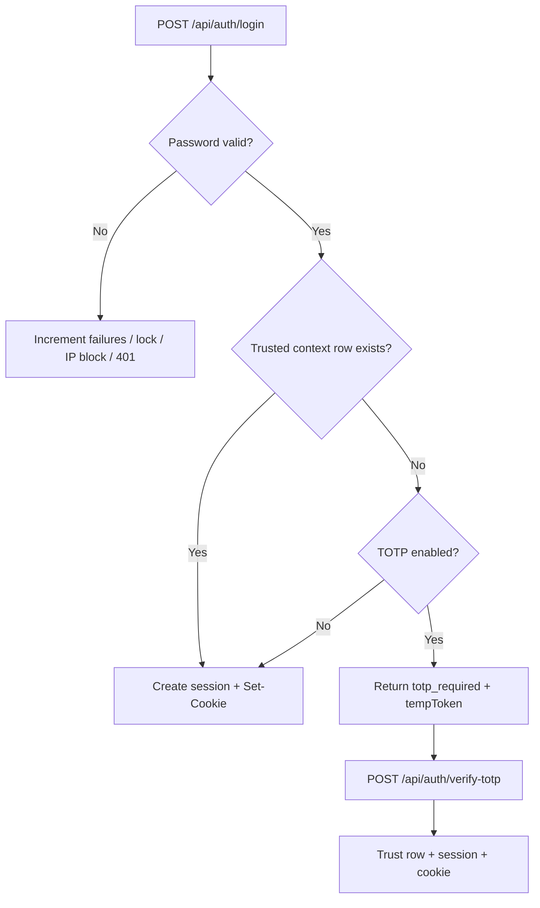

# How Project A.E.G.I.S Works

This document describes the **architecture**, **authentication model**, **database**, **HTTP API**, and **React client** for the Password Encryption & Authentication System visualizer and its live backend.

---

## 1. High-level architecture

```mermaid
flowchart LR
  subgraph client [Browser — Vite + React]
    UI[App, Hero, AuthPortal, SecurityFlow]
    API_CLIENT[api.js — fetch with credentials]
    FP[deviceFingerprint + deviceId]
  end
  subgraph server [Node — Express]
    AUTH[/api/auth/*]
    LOGS[/api/logs]
    DB[(MySQL)]
  end
  UI --> API_CLIENT
  FP --> API_CLIENT
  API_CLIENT -->|JSON + cookies| AUTH
  API_CLIENT --> LOGS
  AUTH --> DB
  LOGS --> DB
```

- **Frontend** (`visualization/`): Single-page app. In development, Vite **proxies** `/api` to the Express server (`vite.config.js`).
- **Backend** (`server/`): REST API, **HTTP-only session cookie** (`aegis_session`), **MySQL** via `mysql2` pool.
- **Database** (`database/schema.sql`): Users, trusted contexts, sessions, audit logs, IP blocks.

---

## 2. Core security idea: trusted context (step-up login)

The product goal (see `docs/prd.md`) is **risk-based MFA**: ask for a second factor only when the login looks “new” or risky.

**Implementation:** After a correct **email + password**, the server checks whether this **user** has previously completed a successful login from the **same IP address** and **same device fingerprint**.

| Situation | Server behavior |
|-----------|------------------|
| **Known context** — a row exists in `trusted_login_contexts` for `(user_id, ip_address, device_fingerprint)` | Issue a **session** immediately (password-only). |
| **Unknown context** — no row yet | If TOTP is enabled, respond with **`totp_required`** and a short-lived **`tempToken`** (JWT). After a valid **TOTP** code, the server **inserts** a trust row and then issues the session. |

This mirrors how **Google** and similar services treat “new device” or “new location”: sign-in may pause for **verification on a device you already trust** or for an **authenticator code** until the new context is trusted.

**Device fingerprint (client):** A SHA-256 hash of `userAgent`, `language`, screen size, and a **stable UUID** stored in `localStorage` (`aegis_device_id`). Same browser profile usually yields the same fingerprint.

**IP address (server):** Taken from `X-Forwarded-For` (first hop) when present (e.g. behind a proxy), else the socket address.

---

## 3. Database tables (MySQL)

| Table | Role |
|-------|------|
| **`users`** | `email`, `password_hash` (bcrypt), `failed_attempt_count`, `locked_until`, `totp_enabled`, `totp_secret` (base32). |
| **`trusted_login_contexts`** | Unique `(user_id, ip_address, device_fingerprint)` — **known** contexts that skip TOTP on next login. |
| **`sessions`** | Opaque session id (64 hex chars), `user_id`, expiry, IP + fingerprint at creation. |
| **`authentication_logs`** | Append-only style audit: event types, IP, fingerprint prefix, optional detail. |
| **`ip_blocks`** | Temporary IP ban after repeated failures. |

Schema file: `database/schema.sql`. Database name default: **`aegis_auth`**.

---

## 4. Authentication flows (server)

### 4.1 Registration — `POST /api/auth/register`

1. Validates email shape and password policy (length + upper, lower, digit).
2. Hashes password with **bcrypt** (10 rounds).
3. Generates a **TOTP secret** (base32), stores on the user row.
4. Writes an **`authentication_logs`** row (`register`).
5. Returns JSON including **`totpSetup.secret`** and **`otpauthUrl`** (for authenticator apps). The UI shows the secret after register; the user must sign in with TOTP the first time from a **new** context.

### 4.2 Login — `POST /api/auth/login`

Body includes `email`, `password`, `deviceFingerprint`.

1. Optional: reject if IP is in **`ip_blocks`**.
2. Load user; if **locked** (`locked_until`), reject.
3. **bcrypt.compare** password. On failure: increment failures, lock account after **3** failures (10 minutes), log failures; after **5** IP-related failures in a window, **block IP** (simplified policy).
4. On success: reset failure counter.
5. If **`trusted_login_contexts`** matches → **create session**, set cookie, return `status: "authenticated"`.
6. Else if TOTP enabled → return `status: "totp_required"` + **`tempToken`** (JWT, embeds user id, ip, fingerprint).
7. Else (TOTP disabled edge case) → trust context + session (rare in default schema).

### 4.3 TOTP verification — `POST /api/auth/verify-totp`

Body: `tempToken`, `code`, `deviceFingerprint`.

1. Verifies JWT and checks **IP and fingerprint** match the token (prevents token reuse from another machine).
2. Verifies TOTP with **otplib** (±30s tolerance).
3. **Upserts** `trusted_login_contexts`, creates **session**, sets cookie, logs `totp_success` and `login_success`.

### 4.4 Session and logout

- **`GET /api/auth/me`** — Returns `{ user: null }` or `{ user: { id, email }, sessionExpires }` based on valid **`aegis_session`** cookie and DB session row.
- **`POST /api/auth/logout`** — Deletes session row, clears cookie, logs `logout`.

### 4.5 Audit log

- **`GET /api/logs`** — Requires valid session; returns recent **`authentication_logs`** for that user (used by the Audit step when signed in).

---

## 5. Frontend (React) — how the pieces fit

| Area | Files / behavior |
|------|-------------------|
| **Entry** | `main.jsx` wraps the app in **`AuthProvider`**. |
| **Auth state** | `context/AuthContext.jsx` — `user`, `login`, `register`, `verifyTotp`, `logout`, `deviceFingerprint`. |
| **HTTP** | `lib/api.js` — `fetch` with **`credentials: 'include'`** for cookies. Base URL: `import.meta.env.VITE_API_URL` or empty (same origin / dev proxy). |
| **Device id** | `lib/deviceId.js` — persistent UUID in `localStorage`. |
| **Fingerprint** | `lib/deviceFingerprint.js` — SHA-256 of UA + screen + device id. |
| **Landing** | `App.jsx` — **Hero**; if not signed in, **`AuthPortal`** (register / login / TOTP inputs); if signed in, chip + **Explore the Secure Flow**. |
| **Auth UI** | `components/AuthPortal.jsx` — register, login, step-up TOTP when API returns `totp_required`. |
| **Visualizer** | `components/SecurityFlow.jsx` — six steps: User Input → Bcrypt → Risk → MFA demo → Audit → Session. **Email** syncs from **`useAuth`** when logged in. |
| **Audit** | `components/AuditLedger.jsx` — if **authenticated**, loads **`GET /api/logs`**; otherwise shows **localStorage** demo ledger. |
| **Dev proxy** | `vite.config.js` — `server.proxy['/api']` → `http://localhost:3001`. |

The **Security Flow** is a **teaching UI**: password hashing, IP risk, TOTP demo, and session copy still illustrate concepts even when the **real** session and audit trail come from the API after login.

---

## 6. Environment & running locally

### 6.1 MySQL

1. Create schema (PowerShell-friendly):

   ```powershell
   Get-Content .\database\schema.sql -Raw | mysql -u root -p
   ```

   Or use `database\import.ps1`.

2. Copy **`server/.env.example`** to **`server/.env`** and set `MYSQL_*`, `JWT_TEMP_SECRET`, and optionally `CORS_ORIGINS`.

### 6.2 API

```bash
cd server
npm install
npm run dev
```

Default port: **3001** (see `PORT` in `.env`).

### 6.3 Frontend

```bash
cd visualization
npm install
npm run dev
```

Open the URL Vite prints (usually **http://localhost:5173**). The browser will call **`/api/...`** which the dev server proxies to the API.

### 6.4 Production build (frontend only)

```bash
cd visualization
npm run build
```

Set **`VITE_API_URL`** to your deployed API origin if the static site and API are on **different** hosts; configure **CORS** and **cookie** `SameSite` / `Secure` correctly for cross-site use.

---

## 7. Diagram: login decision (server)



---

## 8. Related documents

- **`docs/prd.md`** — Product requirements (lockout rules, MFA policy, etc.).
- **`docs/synopsis.md`** — Project synopsis.

---

## 9. Glossary

| Term | Meaning |
|------|--------|
| **A.E.G.I.S** | Project name — evokes “shield / protection” (see product branding). |
| **Trusted context** | A stored **IP + device fingerprint** pair for a user after successful step-up or first-time policy. |
| **Step-up** | Extra factor (here: TOTP) when context is unknown. |

This document reflects the codebase as of the MySQL + Express integration; adjust behavior descriptions if you change routes or schema.
